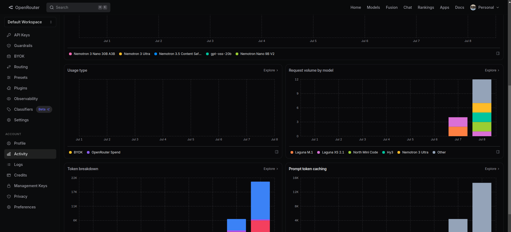
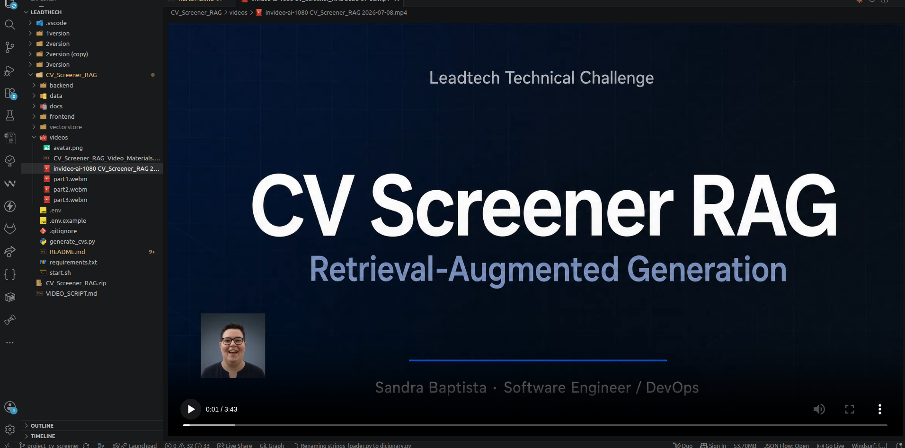

# CV Screener RAG — AI-Powered CV Screening Prototype

> **End-to-end RAG prototype for screening résumés using semantic search + LLM generation.**
> Built for the Leadtech Full-Stack AI Engineer technical assessment.

---

## 🎯 What This Is

This project is a complete, working prototype of an **AI-powered CV screening tool** that lets you ask natural-language questions about a pool of candidates and get grounded, sourced answers.

**Example questions you can ask:**
- *"Who has experience with Python and Kubernetes?"*
- *"Which candidate graduated from UPC?"*
- *"Summarize the profile of Jane Doe"*
- *"Find backend engineers with 5+ years of cloud experience"*
- *"Which candidates speak German fluently?"*

All answers are **grounded strictly in the CV database** — the system retrieves relevant document chunks via semantic search and feeds them to an LLM with explicit instructions not to hallucinate.

---

## 🏗️ Architecture Overview

```
┌───────────────────────────────────────────────────────────────────────────┐
│                           USER INTERFACE                                  │
│  ┌─────────────────────────────────────────────────────────────────────┐  │
│  │  Chat Interface (HTML/CSS/JS) — Single-page, no build step          │  │
│  │  • Question input  • Source citations  • Example prompts            │  │
│  └─────────────────────────────────────────────────────────────────────┘  │
└──────────────────────────────────┬────────────────────────────────────────┘
                                   │ HTTP/JSON
                                   ▼
┌──────────────────────────────────────────────────────────────────────────┐
│                         FASTAPI BACKEND                                  │
│  ┌─────────────────┐  ┌─────────────────┐  ┌─────────────────────────┐   │
│  │  /api/chat      │  │  /api/stats     │  │  /api/ingest            │   │
│  │  RAG endpoint   │  │  Vector store   │  │  Re-index CVs           │   │
│  │  (async)        │  │  metrics        │  │  (background task)      │   │
│  └─────────────────┘  └─────────────────┘  └─────────────────────────┘   │
│                                                                          │
│  ┌─────────────────────────────────────────────────────────────────────┐ │
│  │                    RAG ENGINE (rag_engine.py)                       │ │
│  │  ┌──────────────┐    ┌──────────────┐    ┌──────────────────────┐   │ │
│  │  │  Ingestion   │───►│  Retrieval   │───►│  Generation (LLM)    │   │ │
│  │  │  Pipeline    │    │  (Semantic)  │    │  + Source Tracking   │   │ │
│  │  └──────────────┘    └──────────────┘    └──────────────────────┘   │ │
│  └─────────────────────────────────────────────────────────────────────┘ │
└──────────────────────────────────┬───────────────────────────────────────┘
                                   │
           ┌───────────────────────┼───────────────────────┐
           │                       │                       │
           ▼                       ▼                       ▼
┌─────────────────┐    ┌─────────────────────┐    ┌─────────────────────┐
│   ChromaDB      │    │ SentenceTransformers│    │   OpenRouter LLM    │
│  (Vector Store) │    │   (Embeddings)      │    │  (mistral-7b-free)  │
│  Persistent     │    │  all-MiniLM-L6-v2   │    │  Cloud API          │
│  Cosine sim     │    │  384-dim, local     │    │  No local GPU needed│
└─────────────────┘    └─────────────────────┘    └─────────────────────┘
```

---

## 📁 Project Structure

```
CV_Screener_RAG/
├── 📁 backend/
│   ├── __init__.py
│   ├── main.py          ← bootstrap + lifespan
│   ├── state.py         ← shared rag_engine
│   ├── routes.py        ← todos os endpoints (controller)
│   ├── config.py
│   ├── dictionary.py
│   ├── pdf_processor.py
│   ├── rag_engine.py
│   └── 📁 data/
│       └── 📁 cvs/
│           └── *.pdf
├── 📁 frontend/
│   ├── index.html
│   ├── chat.css
│   └── chat.js
├── 📁 docs/
├── 📁 vectorstore/
├── .env
├── requirements.txt
└── start.sh
```

---

## 🚀 Quick Start

### 1. Prerequisites
- Python 3.9+
- ~2GB free disk space (for models + vector store)

### 2. Setup

```bash
# Clone / navigate to project
cd cv-screener-rag

# Create virtual environment (recommended)
python3 -m venv .venv
source .venv/bin/activate  # Windows: .venv\Scripts\activate

# Install dependencies
pip install -r requirements.txt

# Configure environment
cp .env.example .env
# Edit .env and add your OpenRouter API key (free at openrouter.ai)
```

### 3. Generate CVs & Start

```bash
# Option A: Use the startup script
chmod +x start.sh
./start.sh

# Option B: Manual steps
python3 generate_cvs.py          # Creates 30 synthetic PDFs
cd backend && python3 -m uvicorn main:app --reload
```

### 4. Use
Open your browser at **http://localhost:8000**

---

## 🔑 API Key (Free)

The system uses **OpenRouter** for LLM inference, which offers free tiers for many models:

1. Go to [https://openrouter.ai/settings/keys](https://openrouter.ai/settings/keys)
2. Create a free API key
3. Paste it in `.env`:
   ```
   OPENROUTER_API_KEY=sk-or-v1-xxxxxxxx
   ```

**No credit card required.** The default model (`openrouter/free`) runs on the free tier.



> *Screenshot of the OpenRouter dashboard showing real usage tracking and model activity during project development.*

> **Fallback:** If no API key is provided, the system still works in "retrieval-only mode" — it returns the most relevant raw CV excerpts instead of synthesized answers.

---

## 🧪 API Endpoints

| Method | Endpoint | Description |
|--------|----------|-------------|
| `GET` | `/` | Serves the chat frontend |
| `POST` | `/api/chat` | Main RAG query endpoint |
| `GET` | `/api/stats` | Vector store statistics |
| `POST` | `/api/ingest` | Trigger CV re-ingestion |
| `GET` | `/api/candidates` | List all parsed candidates |
| `GET` | `/health` | Health check |
| `GET` | `/docs` | Auto-generated Swagger UI |

### Example API Call
```bash
curl -X POST http://localhost:8000/api/chat \
  -H "Content-Type: application/json" \
  -d '{"question": "Who has Python experience?", "top_k": 5}'
```

---

## 🛡️ Privacy & Ethics

**All CVs are synthetically generated.** No real personal data, names, or photographs of actual people are used. The dataset is:
- ✅ Fully reproducible (`Faker` + fixed seed)
- ✅ Privacy-safe by design
- ✅ Diverse in roles, skills, and backgrounds
- ✅ Includes realistic structure (photos, experience, education, skills)

---

## 📊 Tech Stack

| Layer | Technology | Purpose |
|-------|-----------|---------|
| **Frontend** | Vanilla HTML/CSS/JS | Zero-build chat UI |
| **Backend** | FastAPI + Uvicorn | Async REST API |
| **Embeddings** | sentence-transformers (`all-MiniLM-L6-v2`) | Local, 384-dim vectors |
| **Vector DB** | ChromaDB | Persistent semantic search |
| **LLM** | OpenRouter (Mistral 7B) | Cloud inference, free tier |
| **PDF Gen** | ReportLab + Pillow | Synthetic CV generation |
| **PDF Parse** | pdfplumber | High-quality text extraction |

---

---

## 🤖 AI Tools & Automation

This project was developed with the assistance of AI tools to **automate, validate, and accelerate** the development workflow. The use of these tools demonstrates the ability to leverage modern AI-powered automation for increased productivity and quality.

### Tools Used

| Tool | Purpose | How It Was Used |
|------|---------|-----------------|
| **Kimi** | Code validation & writing | Assisted with code generation, refactoring, and debugging throughout the backend and frontend development. |
| **Claude** | Code review & architecture | Used for architectural decisions, code review, and improving code quality and structure. |
| **InVideo AI** | Video presentation creation | Automated the creation of the project demonstration video using AI-generated avatar and scene composition. |

### Why This Matters

The integration of AI tools into the development pipeline showcases:
- **Faster iteration cycles** — AI-assisted coding reduced development time significantly.
- **Higher code quality** — AI-powered code review caught edge cases and suggested improvements.
- **Automated documentation** — Documentation was generated and refined with AI assistance, ensuring consistency and completeness.
- **Professional presentation** — The demo video was produced efficiently using AI video generation, demonstrating adaptability to modern content creation workflows.

> **Key takeaway:** Using AI as a force multiplier — not a replacement — for engineering skills. The AI handled repetitive and time-consuming tasks, allowing focus on architecture, logic, and creative problem-solving.

---

## 🎥 Video Presentation

A complete video demonstration of this project is available in the `videos/` folder:

```
videos/
├── invideo-ai-1080 CV_Screener_RAG.mp4   ← Full AI-generated presentation
├── avatar.png                               ← Avatar used in the video
├── part1.webm                               ← Terminal: CV generation
├── part2.webm                               ← Browser: Chat demo
├── part3.webm                               ← VS Code: Code walkthrough
└── CV_Screener_RAG_Video_Materials.md       ← Full script & AI prompt
```

The video was produced using **InVideo AI** with an AI-generated avatar and product screen recordings. It covers the full project walkthrough in under 4 minutes — from data generation to the live chat demo and technical deep-dive.



> *Screenshot from the AI-generated presentation video showing the project title card with the avatar presenter.*

---

## 📄 License

This project was created as a technical assessment prototype. All synthetic data and code are provided as-is for demonstration purposes.
